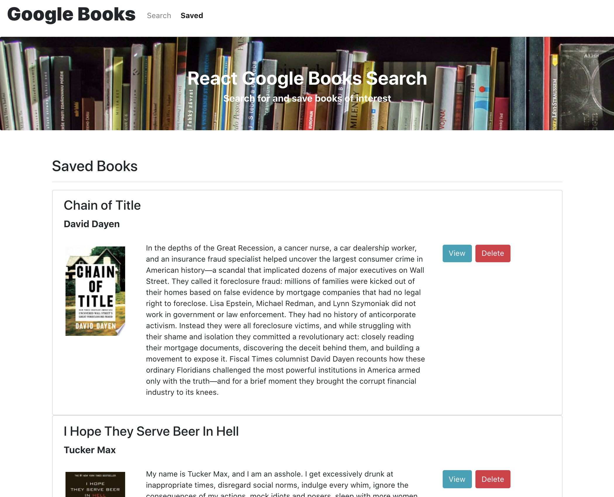

# Google Books Search and Save

Explore the [project page](https://github.com/cynthiwu/google-books-search)

View it live on [GitHub Pages](https://cw-google-books-search-react.herokuapp.com/)

## Table of Contents

- [About The Project](#about-the-project)
  - [Built With](#built-with)
- [Installation](#installation)
- [Usage](#usage)
  - [Demo](#demo)
- [Contributing](#contributing)
- [Contact](#contact)

## About The Project

The goal of this project was to create a full-stack React-based Google Books search and save app. This application was created using React components and helper functions to display books based on user searches. In turn, books can be saved for later user, and deleted when no longer needed.

<hr>


<hr>



<hr>

### Built With

This project was built using:

- JavaScript
- [React](https://reactjs.org/)
- React DOM
- React Router DOM
- [Node.js](https://nodejs.org/api/fs.html)
- [Bootstrap](https://getbootstrap.com/)
- [React Bootstrap](https://react-bootstrap.github.io/)
- [Axios](https://www.npmjs.com/package/axios)
- [Express](https://expressjs.com/)
- [MongoDB](https://www.mongodb.com/cloud/atlas)
- [Mongoose](https://mongoosejs.com/)

## Installation

While not necessary to run the program via the live link above, you may get a local copy up and running by following these simple steps:

1. Clone the repo

```sh
git clone git@github.com:cynthiwu/google-books-search.git
```

2. Install NPM packages (i.e., Inquirer)

```sh
npm install
```

## Usage

This project can be used to search, save, and delete books via the Google Books API.

### Demo

Watch the video below to see how the program works.


## Contributing

Contributions are what make the open source community such an amazing place to learn, inspire, and create. Any contributions you make are **greatly appreciated**.

1. Fork the Project
2. Create your Feature Branch (`git checkout -b feature/AmazingFeature`)
3. Commit your Changes (`git commit -m 'Add some AmazingFeature'`)
4. Push to the Branch (`git push origin feature/AmazingFeature`)
5. Open a Pull Request

## Contributing

Contributions are what make the open source community such an amazing place to learn, inspire, and create. Any contributions you make are **greatly appreciated**.

1. Fork the Project
2. Create your Feature Branch (`git checkout -b feature/AmazingFeature`)
3. Commit your Changes (`git commit -m 'Add some AmazingFeature'`)
4. Push to the Branch (`git push origin feature/AmazingFeature`)
5. Open a Pull Request

## Contact

Cynthia Wu - [@cynthia21wu](https://twitter.com/cynthia21wu) - cynthia21wu@gmail.com

Project Link: [https://github.com/cynthiwu/google-books-search](https://github.com/cynthiwu/google-books-search)

Live Link: [https://cw-google-books-search-react.herokuapp.com/](https://cw-google-books-search-react.herokuapp.com/)
